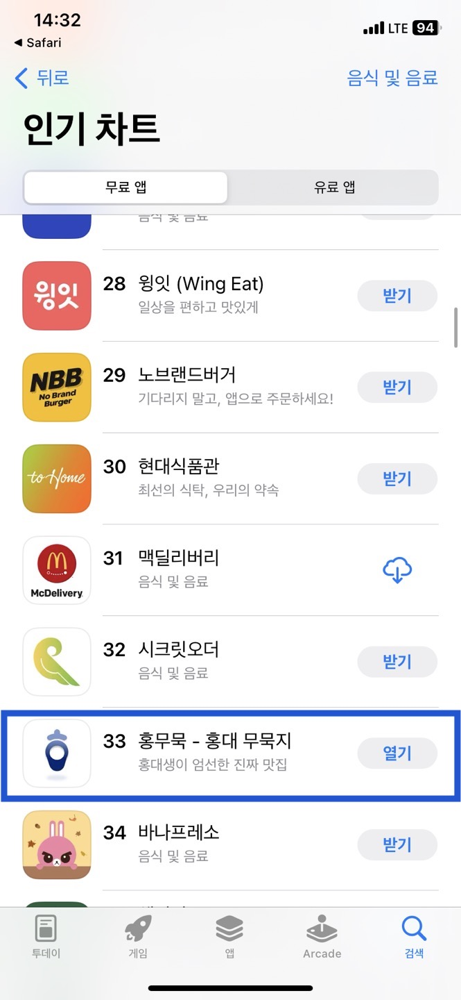

# hongmumuk

---
### Outline
- 홍익대학교 인근 **맛집 추천 어플**
- 앱스토어 누적 다운로드 **831**건
(2023.10.30 기준)
- 앱스토어 음식 및 음료 카테고리  앱 **33**위 랭크 
(2023.09.20 일)
- **언어** : Swift
- **프레임워크**: UIkit
- **아키텍처** : MVC
- **협업** : Git, Figma
- **iOS 앱스토어 링크**
: https://url.kr/6m87d4

### Experience

> **UI**
> 
- 음식 종류 → 종류에 따른 식당 → 식당 상세페이지 플로우
(ex. 일식 → 겐로쿠 우동 → 켄로쿠 우동에 대한 상세 페이지)
- Enum 타입에 따라 화면에 나타낼 데이터 분기 처리하고, 재사용 가능한 CollectionView를 활용해 재사용성 증대
- 네이버지도SDK를 통해 식당의 위/경도 값을 조회 후 해당 위치를 지도에 표기
- UI 컴포넌트 크기를 Snapkit을 활용해 기기에 따라 동적으로 대응

> **Network**
> 
- Alamofire + Router pattern을 활용한 코드 모듈화
- 네이버 검색API를 통해 식당에 대한 블로그 후기 조회 가능

### 사용 라이브러리

- **Alamofire** : Network
- **SnapKit** : Layout
- **Gifu :** GIF 이미지 처리
- **NMapsMap**: 네이버 지도 SDK

### SnapShot 및 기타

