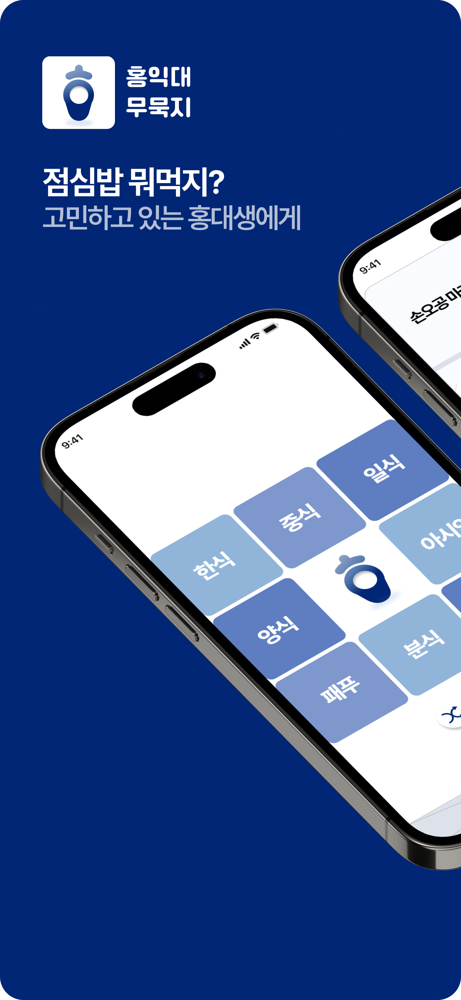
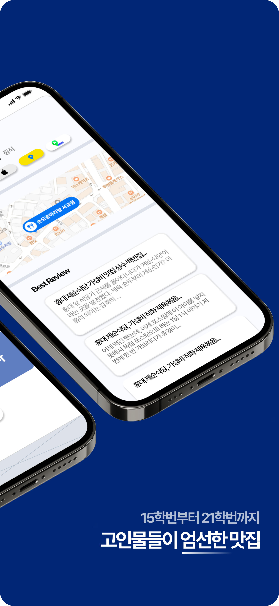
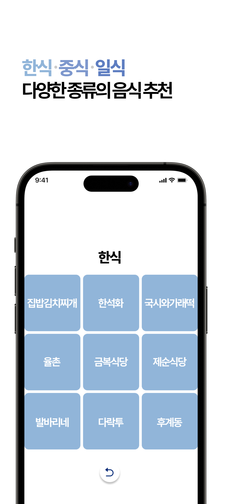
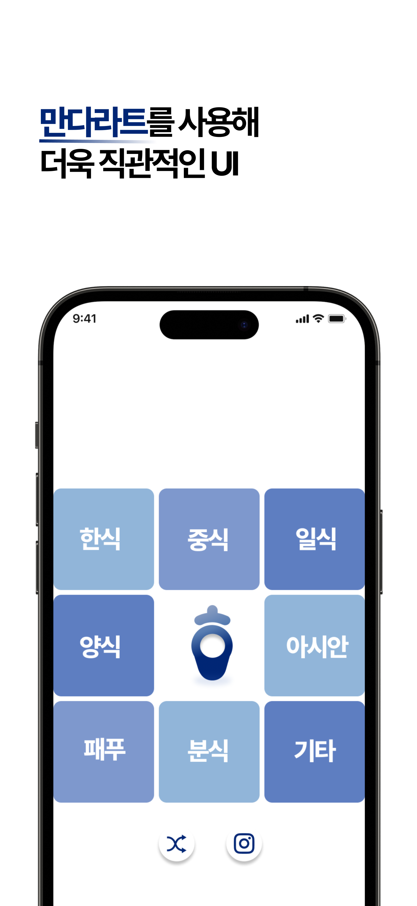
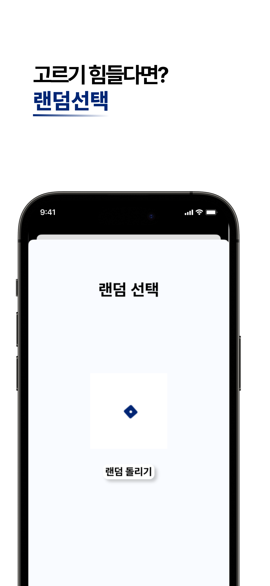

# hongmagip_ios

### O**utline**

- 홍익대학교 인근 **맛집 추천 어플**
- 앱스토어 누적 다운로드 **805**건
(2023.10.17 기준)
- 앱스토어 음식 및 음료 카테고리  앱 **33**위 랭크 
(2023.09.20 일)
- **언어** : Swift
- **프레임워크**: UIkit
- **아키텍처** : MVC
- **협업** : Git, Figma
- **iOS 앱스토어 링크**
: https://url.kr/6m87d4

### Experience

> **UI**
> 
- 음식 종류 → 종류에 따른 식당 → 식당 상세페이지 플로우
(ex. 일식 → 겐로쿠 우동 → 켄로쿠 우동에 대한 상세 페이지)
- Enum 타입에 따라 화면에 나타낼 데이터 분기 처리하고, 재사용 가능한 CollectionView를 활용해 재사용성 증대
- 네이버지도SDK를 통해 식당의 위/경도 값을 조회 후 해당 값을 지도에 표기
- UI 컴포넌트 크기를 Snapkit을 활용해 기기에 따라 동적으로 대응

> **Network**
> 
- Alamofire + Router pattern을 활용한 코드 모듈화
- 네이버API를 통해 식당에 대한 블로그 후기 조회, 매서드 활용해 HTML 태그 제거

### 사용 라이브러리

- **Alamofire** : Network
- **SnapKit** : Layout
- **Gifu :** GIF 이미지 처리
- **NMapsMap**: 네이버 지도 SDK

### SnapShot 및 기타

  
  

  
  
  
  

---

### 희망 개선사항

- MVVM 패턴으로 변경
- 페이지 네이션 기능 추가
- 블로그 제목에 대한 실시간 검색 기능
- 디자이너 협의 후 UI 좀 더 깔끔하게 수정
- Kingfisher를 통한 이미지 처리, 캐싱
(상세페이지에서 네이버 API를 통해 받을 수 있는 사진을 통해 View를 좀 더 다채롭게 수정)
- Fastlane 도입을 통한 배포 자동화
- 네이버 API를 통해 수령한 검색 결과에 대한 정렬 기능 추가(추천순, 최신순, 정확도 순 등)
- Do-try-Catch문을 통한 네트워크 에러 처리
- 다국어 대응
- Firebase 활용 해 유저가 ‘좋아요’ 기능 추가
- Firebase DB를 활용해 통계 뷰 추가(주간 인기, 실시간 인기 등)
- 사용자가 랜덤할 식당을 선택적으로 추가/삭제 수 있는 기능
- Rx 활용
